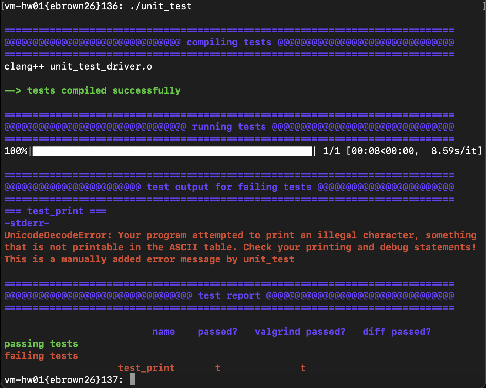

# Unit test printing error
Ellis Brown, 9-21-2022

## Problem
When students encounter Unicode errors, the Python unit_test script completely crashes, hiding all useful outputs from that test. This behavior can be replicated by running the following test through unit_test

file: `unit_tests.h`
```c++
#include<iostream>

void test_print() {
    for (char c = 0; c < 255; c++) {
        std::cout << c;
    }
}
```

Running this through a test will generate the following error, __following a timeout__:
```


===============================================================================
@@@@@@@@@@@@@@@@@@@@@@@@@@@@@@@ compiling tests @@@@@@@@@@@@@@@@@@@@@@@@@@@@@@@
===============================================================================
clang++ unit_test_driver.o

--> tests compiled successfully

===============================================================================
@@@@@@@@@@@@@@@@@@@@@@@@@@@@@@@@ running tests @@@@@@@@@@@@@@@@@@@@@@@@@@@@@@@@
===============================================================================
  0%|                                                                                                                                                                           | 0/1 [00:01<?, ?it/s]
concurrent.futures.process._RemoteTraceback: 
"""
Traceback (most recent call last):
  File "/usr/sup/Python-3.9.2/lib/python3.9/concurrent/futures/process.py", line 243, in _process_worker
    r = call_item.fn(*call_item.args, **call_item.kwargs)
  File "/usr/sup/Python-3.9.2/lib/python3.9/concurrent/futures/process.py", line 202, in _process_chunk
    return [fn(*args) for args in chunk]
  File "/usr/sup/Python-3.9.2/lib/python3.9/concurrent/futures/process.py", line 202, in <listcomp>
    return [fn(*args) for args in chunk]
  File "/comp/15/bin/unit_test", line 594, in run_test_with_valgrind
    test = run_test(test)
  File "/comp/15/bin/unit_test", line 394, in run_test
    test.standard_test = RUN(exec_list, stdin=test.stdinFile)
  File "/comp/15/bin/unit_test", line 205, in RUN
    return subprocess.run(cmd_ary, stdin=infile, capture_output=True, universal_newlines=True)
  File "/usr/sup/Python-3.9.2/lib/python3.9/subprocess.py", line 507, in run
    stdout, stderr = process.communicate(input, timeout=timeout)
  File "/usr/sup/Python-3.9.2/lib/python3.9/subprocess.py", line 1134, in communicate
    stdout, stderr = self._communicate(input, endtime, timeout)
  File "/usr/sup/Python-3.9.2/lib/python3.9/subprocess.py", line 2019, in _communicate
    stdout = self._translate_newlines(stdout,
  File "/usr/sup/Python-3.9.2/lib/python3.9/subprocess.py", line 1011, in _translate_newlines
    data = data.decode(encoding, errors)
UnicodeDecodeError: 'utf-8' codec can't decode byte 0x80 in position 128: invalid start byte
"""

The above exception was the direct cause of the following exception:

Traceback (most recent call last):
  File "/comp/15/bin/unit_test", line 612, in <module>
    tests = process_map(run_test_with_valgrind, test_names, max_workers = args['jobs'])                     
  File "/usr/sup/Python-3.9.2/lib/python3.9/site-packages/tqdm/contrib/concurrent.py", line 130, in process_map
    return _executor_map(ProcessPoolExecutor, fn, *iterables, **tqdm_kwargs)
  File "/usr/sup/Python-3.9.2/lib/python3.9/site-packages/tqdm/contrib/concurrent.py", line 76, in _executor_map
    return list(tqdm_class(ex.map(fn, *iterables, **map_args), **kwargs))
  File "/usr/sup/Python-3.9.2/lib/python3.9/site-packages/tqdm/std.py", line 1180, in __iter__
    for obj in iterable:
  File "/usr/sup/Python-3.9.2/lib/python3.9/concurrent/futures/process.py", line 559, in _chain_from_iterable_of_lists
    for element in iterable:
  File "/usr/sup/Python-3.9.2/lib/python3.9/concurrent/futures/_base.py", line 600, in result_iterator
    yield fs.pop().result()
  File "/usr/sup/Python-3.9.2/lib/python3.9/concurrent/futures/_base.py", line 440, in result
    return self.__get_result()
  File "/usr/sup/Python-3.9.2/lib/python3.9/concurrent/futures/_base.py", line 389, in __get_result
    raise self._exception
UnicodeDecodeError: 'utf-8' codec can't decode byte 0x80 in position 128: invalid start byte
```

This will both take a while, and prevent useful output from the students, as this is _scary_ and therefore not something they will probably fix easily.

## Solution
Update the unit test framework to CATCH this error, and print a more useful error message, and report that the test __timed out__.

```python
# Begins on unit_test line 590
def run_test_with_valgrind(test_name):
    try:
        test = Test(test_name)
        test = run_test(test)
        test = run_valgrind(test)
    except UnicodeDecodeError:
        return unicode_error_test(test_name)
    return test

def unicode_error_test(test_name):
    test = Test(test_name)
    test.standard_test = subprocess.CompletedProcess(args=['timeout', TIMEOUT, './a.out', test_name], returncode=132, stdout='', stderr='UnicodeDecodeError: Your program attempted to print an illegal character, something that is not printable in the ASCII table. Check your printing and debug statements! This is a manually added error message by unit_test')
    test.valgrind_test = subprocess.CompletedProcess(args=['timeout', TIMEOUT, './a.out', test_name], returncode=132, stdout='', stderr='')
    return test
```

The new function `unicode_error_test` will catch the error and report to the student the message above.

## Considerations

This style of solving one-off problems may introduce technical-debt if done frequently, but has only been done once. Therefore, this solution works _well enough_ for our use cases, without over-engineering the code base


## Results
The results can be found here:


